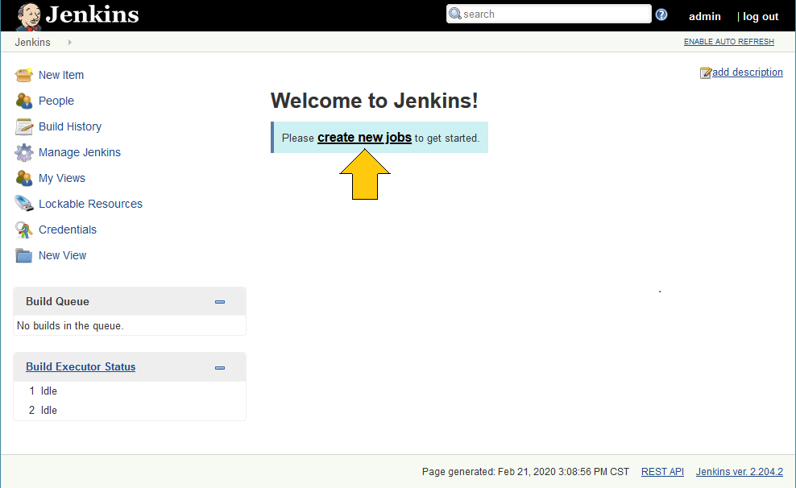
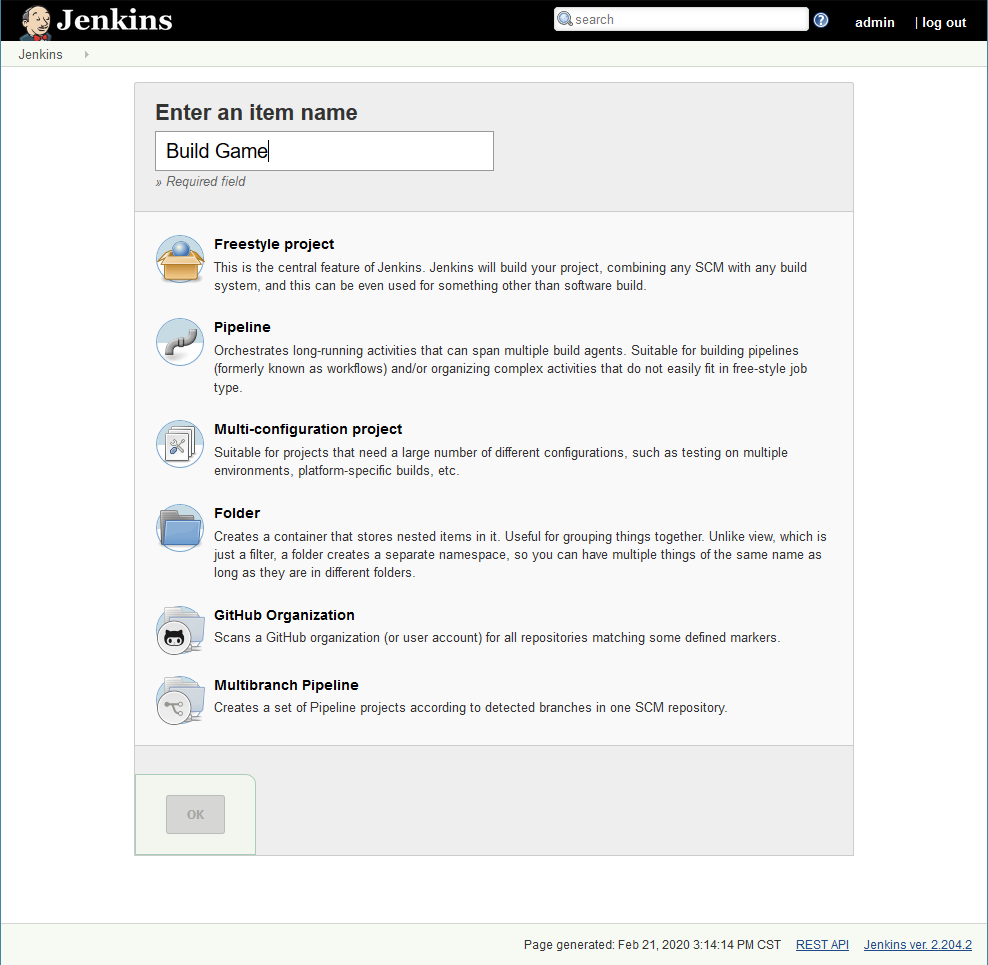
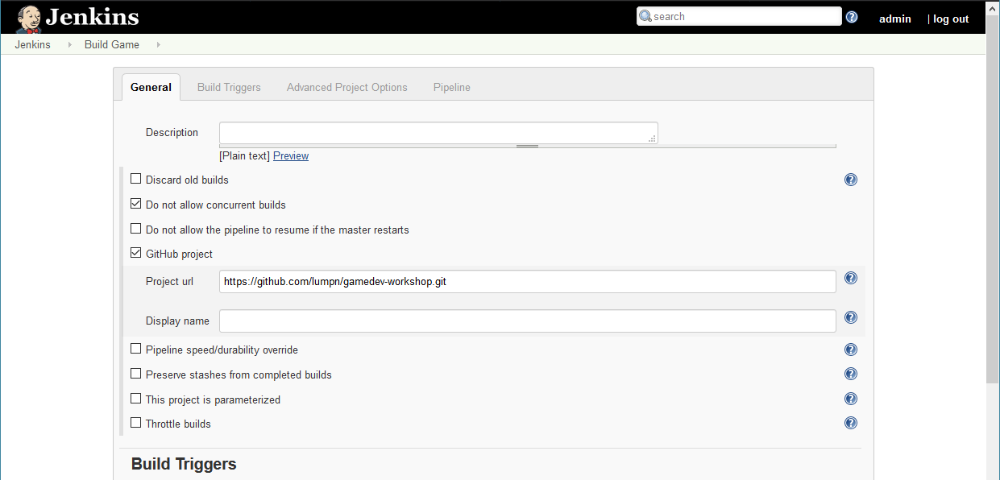
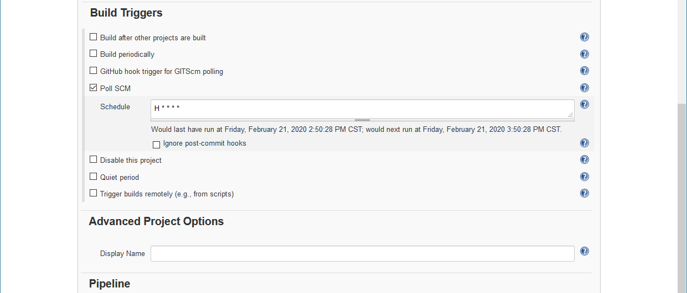

# Continuous Integration
Keep testing. Keep shipping. Catch bugs early.

## Problem
Game assets tend to have lots of dependencies across various disciplines. Projects can easily break when people change things without realizing which other things depend on them. The longer it takes to notice the problem, the longer it takes to identify and fix the change that caused it.

Furthermore, at any given time there's a slightly different work-in-progress version of the project on each developer's machine, making it difficult to reproduce issues seen on another machine. Some issues might even manifest on the target platform only.

```
¯\_(ツ)_/¯
It works on
my machine.
```

## Solution
We want to reduce the time between making a change and seeing it on the target platform as much as possible. We want to have checks that tell us when something broke. We want to run those checks after every change. That means we have to automate the entire process.

We achive continuous integration and delivery by
1. maintaining a single repository,
2. automating the build process,
3. automating the testing process, and
4. automating the shipping process.

## Maintaining a single repository
If you're already using [version control](https://en.wikipedia.org/wiki/Version_control) you can skip ahead. Keep using what works for you. If you're not using version control yet, currently your best options are [GitHub Enterprise](https://github.com/enterprise) and [Plastic SCM](https://www.plasticscm.com/). Both [cost](https://github.com/pricing) [money](https://www.plasticscm.com/pricing), but not too much. They are well worth it. Stay away from [Unity Collaborate](https://unity.com/unity/features/collaborate). It doesn't work properly and its feature set is severly limited. It might be useful for game jams, but that's about it.

## Automating the build process
If you're using GitHub Enterprise, you might want to give [GitHub Actions](https://github.com/features/actions) a try. [Unity Cloud Build](https://unity3d.com/unity/features/cloud-build) is too basic for anything serious. We'll be using [Jenkins](https://jenkins.io/) here, which is free, open source, and runs locally.

### Jenkins
We connect Jenkins to the repository and tell it to build the project every time a change gets committed. That's a lot of builds, so it's best to [install Jenkins](https://jenkins.io/download/thank-you-downloading-windows-installer-stable/) on an unused machine, which we will use as our build server.

After installing Jenkins and logging in to http://localhost:8080 with the initial admin password, Jenkins will ask which plugins to install. We're going to "Install suggested plugins". We won't need most of them, but it's too tedious to pick plugins manually. Speaking of plugins, everything in Jenkins is a plugin, most of them contributed by volunteers. Most of them are not *production ready*, which is why you will often find several plugins for the same task. We're going to bypass all that keep things as simple as possible.

### Build job
To make Jenkins build the game, we need to wrap the build process in a Jenkins job, so let's create a new job using the "Pipeline" template.







The job configuration in Jenkins is fairly minimal. All we need is for Jenkins to download the [pipeline script](https://jenkins.io/doc/book/pipeline/jenkinsfile/) from our version control system and then execute it.

In [our pipeline script](BuildScripts/Jenkins/Jenkinsfile), we
1. update to the latest revision on the repository,
2. start Unity and let it import assets,
3. run the unit tests,
4. make a build, and finally
5. upload the build.

```groovy
    stage('Import Assets') {
      steps {
        bat "$UNITY -batchmode -logFile - -projectPath $PROJECT -buildTarget $PLATFORM -quit -accept-apiupdate"
      }
    }
    stage('Run Unit Tests') {
      steps {
        bat "$UNITY -batchmode -logFile - -projectPath $PROJECT -buildTarget $PLATFORM -runEditorTests"
      }
    }
    stage('Build') {
      steps {
        bat "$UNITY -batchmode -logFile - -projectPath $PROJECT -buildTarget $PLATFORM -quit -buildWindows64Player $OUTPUT"
      }
    }
```

### Build agent


## Automatic the testing process
We're already running the unit tests before each build. It is a good idea to cover as many potential problems as possible using unit tests. We start with a basic set of consistency checks.

```csharp
        [Test]
        public void ShaderHasErrors()
        {
            var infos = ShaderUtil.GetAllShaderInfo();
            foreach (var info in infos)
            {
                Assert.IsFalse(info.hasErrors, "Shader '{0}' has errors.", info.name);
            }
        }
```

It takes time to develop a comprehensive test suite. A good guideline is to add a test every time a new issue appears in the build. The idea is to write the new test such that it prevents the issue from ever happening again.

## Automating the shipping process
So we now have a build that passed basic checks, but that still doesn't mean much. What we need is *real people* testing it.

```
It does not exist until you ship it.
```

```groovy
    stage('Upload Build') {
      steps {
        echo "$STEAMCMD +login $STEAMUSERNAME $STEAMPASSWORD +run_app_build $STEAMSCRIPT"
      }
    }
```


## Method
Verify project automatically.

## Prerequisites
- Version control
- Jenkins
- Automated tests
  - Unit test
  - Asset test
  - Integration test
- Build server
- PostProcessorBuild attribute

## Other
- SteamPipe
- F8 feedback
- Analytics
- Sentry

## Details
Manage Jenkins -> Global Tool Configuration -> Git
https://stackoverflow.com/questions/51500698/where-to-find-option-to-change-workspace-path-location-in-jenkins
Actually has to modify config.xml in the Jenkins install dir. See workspaceDir element.
Better yet, add a local agent. Start like Launch agent via execution of command on the master c:\Program Files (x86)\Jenkins\jre\bin\java -jar W:\Jenkins\agent.jar

## Notes
1. Install Jenkins from .msi (doesn't ask any options)
2. Open localhost:8080
3. Unlock with initial admin password (follow instructions on screen)
4. Select plugins to install (more later)
5. Select none (top), select GitHub, GitHub Authentication (doesn't work?!), Pipeline, install.
6. Skip creating first admin user. Continue as admin (bottom).
7. Accept default instance configuration (http://localhost:8080, no https!). Save and finish.
8. Manage Jenkins -> Configure System -> Usage: ony build jobs with label expressions matching this node

9. Manage Jenkins -> Global Security -> Agents -> TCP port for inbound agents: random
10. Manage Jenkins -> Manage Nodes -> New Node (name Agent1, permanent agent, keep defaults)
11. Manage Jenkins -> Manage Nodes -> Agent1 -> agent.jar save file.
12. Create batch file "c:\Program Files (x86)\Jenkins\jre\bin\java" -jar agent.jar -jnlpUrl http://localhost:8080/computer/Agent1/slave-agent.jnlp -secret 7a729911603e5918b83052a24e7258dc26ad85359831d6e040d0999f5de5eb8b 
13. Install as service...

14. Manage Jenkins -> Global Tool Configuration -> Git -> Delete -> Add Git -> JGit
15. Add jobs...

## TODO:
- add broken reference check
- jgit doesn't support LFS
- consider installing with standard plugins to simplify things
- git lfs checkout
- undo changes from previous build without deleting library folder
- delete build output
- upload to steam
- download git on the agent https://git-scm.com/download/win
-- select Git LFS when installing!
- use JGit on the master to download the latest jenkinsfile
- gotta use a multibranch pipeline for github. blue ocean does a decent job creating it, but we have to manually switch to jenkinsfile and remove clean before/after checkout.

## See also
[Unity Cloud Build](https://unity3d.com/unity/features/cloud-build) does not work with consoles.


## Further reading
- [Continuous Integration](https://martinfowler.com/articles/continuousIntegration.html) by Martin Fowler

## References
- https://martinfowler.com/articles/continuousIntegration.html
- https://jenkins.io/blog/2017/04/05/welcome-to-blue-ocean/
- https://jenkins.io/blog/2017/04/06/welcome-to-blue-ocean-editor/
- https://jenkins.io/blog/2017/04/11/welcome-to-blue-ocean-pipeline-activity/
- https://jenkins.io/blog/2017/04/12/welcome-to-blue-ocean-dashboard/

- [Unite 2015 - Continuous Integration with Unity](https://www.youtube.com/watch?v=kSXomLkMR68)
- [Continuous integration and automated testing](http://itmattersgames.com/2019/02/18/continuous-integration-and-automated-testing/)
- [Unity Build Automation with Jenkins](https://smashriot.com/unity-build-automation-with-jenkins/)
- [Jenkins for Unity](https://github.com/CarlHalstead/Jenkins-for-Unity)
- [Unity build automation with Jenkins](https://benhoffman.tech/general/2018/07/12/unity-build-automation-with-jenkins.html)


- [Setting Up a Build Server for Unity with Jenkins](https://www.youtube.com/watch?v=4J3SmhGxO1Y)
