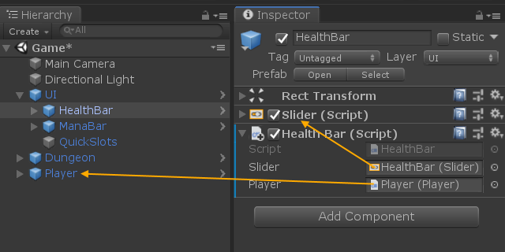

# 為何拆解耦合（decoupling）

需求會改變、專案會成長、軟體會演化。

# 問題

在系統的各模組間有高度耦合的狀況代表：
- 難以把每個組件的內容隔離開來描述
- 組件難以單獨進行測試
- 難以重複利用組件

以上種種都會讓我們難以看懂、維護並發展每個組件，以及整體的系統。


# 解方

我們必須讓組件盡量 [模組化](https://en.wikipedia.org/wiki/Modular_programming) 才能利於分別描述、測試與重複利用。模組化的組件能夠更容易的被修改或替換，讓我們的系統更具彈性，得以適應各種不同的需求修改。我們可以透過拆解耦合的相依組件，並定義最少介面的手段來達到模組化的目的。


# 範例

舉例來說，假設我們要開發一款類似 [《暗黑破壞神》](https://en.wikipedia.org/wiki/Diablo_(video_game)) 的遊戲，在其中我們有一個玩家角色，還有一個顯示玩家現有血量跟法力的介面。我們要怎麼把血條顯示跟玩家的血量值做聯結？這兩個組件分別附著在完全不同的遊戲物件上！

## Singleton 模式

我們很快發現到，整個遊戲裡只有一個玩家角色，也只有一個介面。那不就正好能用上 [Singleton 模式](https://en.wikipedia.org/wiki/Singleton_pattern) 來存取其他組件了嗎？[太巧妙了！](https://youtu.be/wv4eTE0aUiQ)

```csharp
public sealed class Player : MonoBehaviour
{
    public static Player main { get; private set; }

    public float maxHealth;
    public float health;

    void Start()
    {
        main = this;
    }

    // ...
}
```

```csharp
public sealed class HealthBar : MonoBehaviour
{
    [SerializeField] private Slider slider;

    void Update()
    {
        var player = Player.main;
        slider.maxValue = player.maxHealth;
        slider.value = player.health;
    }
}
```


搞定。太輕鬆了。開始著手 [下個任務](https://www.reddit.com/r/restofthefuckingowl/) 吧。沒過多久，我們就寫好了物品欄、裝備、道具、寶石、鑲嵌凹槽、技能樹、角色數值、法術書、Buff，還有敵人系統到遊戲中。這些組件都需要互相溝通。那就加入更多 singleton 吧，易如反掌！


好等等，看起來沒那麼簡單了。就在這時，我們的遊戲企劃突然想到，如果能有個新法術，可以讓身上所有裝備的屬性加值效果加倍就太好了。哦，還有，順便增加個玩家必須每 20 秒殺死敵人才能維持的狂暴 buff。每當新增一個 singleton，程式設計師的心就酸了一下。如果再收到一個新的錯誤回報，說「為什麼在雙重 buff 時限結束後角色數值沒有正確重置啊！」的話，大家可能就會覺得乾脆辭職去賣雞排還比較快活吧。

還是別這樣做吧。如果我告訴你有個方法，讓每個組件都可以被隔離、模組化，而且還能和其他組件共享資訊呢？這就必須討論 [dependency injection](https://en.wikipedia.org/wiki/Dependency_injection) 了！

## Dependency injection（常譯「相依性注入」）

讓我們來仔細看看 [dependency injection](https://en.wikipedia.org/wiki/Dependency_injection)、[separation of concerns (SoC，常譯「關注點分離」)](https://en.wikipedia.org/wiki/Separation_of_concerns)，與 [inversion of control (IoC，常譯「控制反轉」)](https://en.wikipedia.org/wiki/Inversion_of_control) ，這些看起來都好像很高深、很複雜，然後可能還要下載額外的框架才能使用，還是得轉換到一個全新語言去比較快...（是嗎？）

此處關鍵是意識到，其實 [Unity 裡的 Inspector](https://docs.unity3d.com/Manual/UsingTheInspector.html) *就是* 一個 dependency injector（注入器）。事實上，我們已經使用了這個功能來注入相依組件。在 [前面範例](#singleton-模式) 的 `HealthBar` 當中對介面組件 `Slider` 的參考*就是*我們透過 Unity Inspector 來*注入*的相依性了。就跟指定一個欄位一樣簡單。很誇張嗎？但其實這差不多就是關於 dependency injection 你需要知道的全部了。

```csharp
public sealed class Player : MonoBehaviour
{
    public float maxHealth;
    public float health;

    // 娘子快來看，沒有 singleton！
    // ...
}
```

```csharp
public sealed class HealthBar : MonoBehaviour
{
    [SerializeField] private Slider slider;
    [SerializeField] private Player player;

    void Update()
    {
        slider.maxValue = player.maxHealth;
        slider.value = player.health;
    }
}
```



好，所以我們把 singleton 模式換掉，改成使用注入的玩家組件參考，歡呼吧！不過...，我們到底從中獲得什麼好處了嗎？重新再來看一下我們原本遭遇的問題吧：

- [x] 把每個組件的內容隔離開來描述
- [ ] 組件可以單獨進行測試
- [ ] 重複利用組件

其實真的還沒有多大改變。我們大概能在不去看 `Player` 定義的情況下，來猜測 `HealthBar` 到底在做什麼，但是我們還是無法開一個空場景，在不把 `Player` 也拉進來場景中的情況下去單獨測試它。我們也無法重複利用 `HealthBar` 的程式碼在 `ManaBar` 或其他類似的顯示上。我們得複製貼上一份相同的程式碼，然後把每個 `health` 字眼都替換成 `mana`。真令人失望。

之後，我們可能也會想進一步清理遊戲架構，把介面組件移到屬於它自己的場景裡並壓在遊戲場景上。但這樣我們的參考就爛了。這下我們得怎麼讓 `HealthBar` 得知 `Player` 呢？它們根本在不同場景中啊！於是乎，看起來 dependency injection 也不怎麼管用嘛，跟那些只有在理論上聽起來有用的想法沒兩樣。

修蛋幾勒！

## ScriptableObjects

今天要講的第二個關鍵是，我們可以不單純只注入指向其他組件的參考，也可以注入對 `ScriptableObject` 的參考。這是拿來 [存放資料，*且獨立於類別實體*的容器](https://docs.unity3d.com/Manual/class-ScriptableObject.html) 。難道說我們可以用它來存放玩家的血量值，而不用放在 `Player` 組件裡面嗎？答對了！現在馬上就來試試吧。

```csharp
[CreateAssetMenu]
public sealed class BoundedFloat : ScriptableObject
{
    public float maxValue;
    public float value;
}
```

```csharp
public sealed class StatusBar : MonoBehaviour
{
    [SerializeField] private Slider slider;
    [SerializeField] private BoundedFloat data;

    void Update()
    {
        slider.maxValue = data.maxValue;
        slider.value = data.value;
    }
}
```

```csharp
public sealed class Player : MonoBehaviour
{
    [Header("Stats")]
    [SerializeField] private BoundedFloat health;
    [SerializeField] private BoundedFloat mana;

    // ...
}
```


我們把所有 *資料* 都移到 *資料容器* 裡面，並在組件裡面去參考它們。`ScriptableObject` 存在於 Unity 的資源（asset）清單中，而且可以從任何 prefab、物件及場景中參考它們。我們也同時可以整合針對血條與法力條的程式碼，因為這兩個東西都同樣只關心一個最大值跟一個現在值。在我們的所有介面組件中，再也沒有指向 `Player` 的參考了，反之亦同。介面與玩家組件都只參考了 *資料*。它們甚至不需要去管是不是同一份資料。


這樣終於完成了嗎？讓我們再回顧一次問題點：

- [x] 把每個組件的內容隔離開來描述
- [x] 組件可以單獨進行測試
- [x] 重複利用組件

閱讀程式碼時，我們可以理解 `Player` 的行為，但不需要去管介面的 `StatusBar`，反之亦同。兩者之間不再存有相依性。我們可以把 `Player` 丟進一個空場景中，隨便指定一些 [測試用的血量與法力值](https://en.wikipedia.org/wiki/Mock_object) 就能執行場景，毫無問題。基礎型別資料（Plain Old Data, POD）非常容易複製。

我們也可以把介面丟到一個空場景中，同樣任意指定一些測試數值，就執行場景。我們甚至可以利用變動測試數值，看看血條跟法力條實際動起來的感覺。這下介面設計師可以瘋狂美化他們想要做到的視覺效果，而且根本不用執行實際完整的遊戲了。介面的設計迭代從來沒這麼方便過！

我們還沒開始實作任何其他的遊戲組件，就已經開始在重複利用程式碼了。針對兩個數值條，我們只須使用一份程式，而且這個 `BoundedFloat` 大概之後在很多類似數值需求的場合有機會派上用場。

# 重構（Refactoring）

Dependency injection
最美好的一個地方是，我們也可以把它用於既有專案上，並不需要從頭開始重寫。我們可以亦步亦趨把每個組件慢慢切出來，並將相依資料移到
`ScriptableObject` 裡面，讓組件之間的直接聯結變成對資料的參考。一旦把一個組件完全解除耦合之後，我們就能輕易地單獨針對它做測試跟重構。

# 延伸閱讀

- [Unite Austin 2017 - Game Architecture with Scriptable Objects](https://youtu.be/raQ3iHhE_Kk) by [@roboryantron](https://github.com/roboryantron)
- [Unite 2016 - Overthrowing the MonoBehaviour Tyranny in a Glorious Scriptable Object Revolution](https://youtu.be/6vmRwLYWNRo) by [@richard-fine](https://github.com/richard-fine)

# 翻譯
如果你覺得這個工作坊有其價值，並通曉另一個語言，我們非常歡迎任何幫助工作坊內容進行翻譯的協助。把本儲存庫內容 clone 下來後，增加一份特定語言在地化的 README.md，例如 README-pt-BR.md，並送 PR 給我們。
