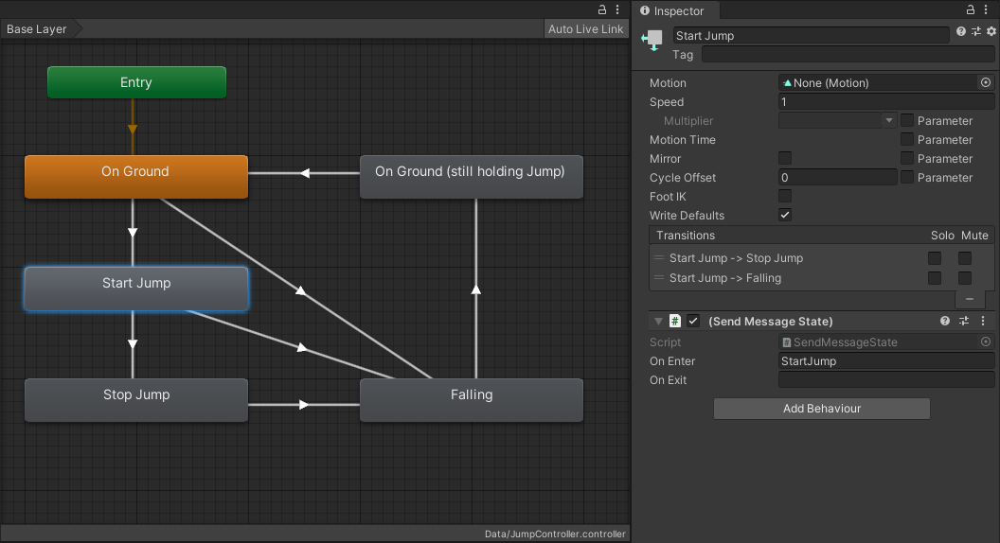

# 為何使用「狀態機」
避免程式碼義大利麵化。所有事物都可視為一種狀態機，並避免狀態與邏輯的耦合。

# 問題
當一個物件的內在狀態改變時，行為也會跟著改變。聽起來很抽象，但是這是在遊戲程式中非常常見的案例。考量以下狀況：

1. 輸入判定：在格鬥遊戲中，按下 *P鍵* 出拳，往往會依照角色目前正在前進、後退、直立、跳躍或蹲下等不同狀態，而出不同的拳。
2. 電腦操縱角色：機器人角色在看到玩家角色時，應該要考量角色的目前血量、武器種類、同伴數量等條件來做出不同的反應。
3. 遊戲流程控制：退出、暫停或儲存遊戲等功能的可執行與否，應該要依照目前遊戲是否正在載入、儲存、已經暫停、正在退出等狀態來決定。

上述這些常見情境的共通點，就是它們往往充滿各式各樣的特例。為了要實作相關邏輯來對應各種特例，你的程式碼很快就變成義大利麵了。

```csharp
if (Input.GetButton("Punch")) {
    if (player.velocity.z > 0) {
        ForwardPunch();
    } else if (player.velocity.z < 0) {
        Grapple();
    } else if (player.isJumping) {
        if (Input.GetAxis("Vertical") > 0) {
            UpwardPunch();
        } else {
            DownwardPunch();
        }
    } else if (player.isDucking) {
        UpwardPunch();
    } else {
        StandingPunch();
    }
}
```

當你才剛寫完上述程式碼，遊戲企劃又突然冒出對你說，在蹲下兩秒集氣後起身瞬間按下 *P鍵* 要可以使出必殺技「升龍臂」哦！還有還有，在跳躍滯空高度上升期間，連按 *P鍵* 兩下要可以丟出火球。

```
(╯°□°）╯︵ ┻━┻
```

# 解決方案
實際上，各種特例跟「狀態」是等價的。你程式碼中的每個條件分支，都是一個不同的狀態。在紙上先用筆把各種狀態畫下來，並用箭頭連接來代表狀態的改變。當你開始熟悉這樣的操作模式後，就會發現這種結構無所不在。


困難的地方在於，如何保證所有的狀態改變，都透過正確的條件、在正確的時機被觸發。但這件事跟實作 *P鍵* 要在各個狀態下執行什麼東西，是可以各自獨立的。我們切斷處理狀態改變部分，與執行行動部分的耦合，那就更容易在更乾淨的情境下來各別檢視他們。

現在我們知道問題的輪廓了，但要怎麼實作出來？

## Animators
上面那張圖，其實很像 [Unity 的 Animator 動畫控制系統](https://docs.unity3d.com/Manual/Animator.html)。而實際上，這就是我們現在要利用的，因為 Animator 動畫控制器實際上能做到的事情遠遠不只單純播放動畫而已。讓我們來看看實例上怎麼運用吧。

# Example
Suppose we are implementing input handling for a Jump 'n' Run platforming game. We want to support [genre staples](https://celestegame.fandom.com/wiki/Moves) like
1. variable jump height that depends on how long the player holds the *Jump* button,
2. [coyote time](https://twitter.com/DavesInHisPants/status/1281189584462917632) which allows the player to jump after running off an edge, and
3. double jump, a second jump while in mid air.

## Jump controller


We start by creating a new animator controller. Our boolean input parameters are whether the *Jump* button is pressed and whether the player is currently on the ground.

Our first state is `On Ground`. That is when the player is able to jump at all. We also need the opposite state, which is `Falling`, and then a few more states which become clearer when we look at the conditions for the state transitions.


Let's look at the `On Ground` state. When the player presses the *Jump* button we start a jump. When the player releases the *Jump* button, we stop the jump by running some game logic to make sure the player character doesn't rise much higher anymore. We then immediately transition to the `Falling` state and we keep falling until the player character touches ground again.

If we transitioned back to `On Ground` straight from `Falling` as soon as the player touches ground, we would end up in a situation where the player would keep bouncing up and down like on a trampoline simply by keeping the *Jump* button pressed, because our state machine would immediately transition back to `Start Jump`. To fix that, we have to add an intermediary state `On Ground (still holding Jump)`.

Wow, jumping is hard. There is a lot of logic in our state machine already and we have only covered the basic variable jump height so far. We can see how this would have been a lot of spaghetti code already.

### Providing parameters
For our jump controller to work, we need to keep its parameter values updated. Luckily Unity makes talking to animator controllers easy.
```csharp
public class JumpControllerParameterProvider : MonoBehaviour
{
    private bool onGround;

    void Update()
    {
        animator.SetBool("OnGround", onGround);
        animator.SetBool("JumpButton", Input.GetButton("Jump"));
    }

    void FixedUpdate()
    {
        onGround = Physics.SphereCast(rigidbody.position, radius, Vector3.down,
                              out RaycastHit hitInfo, distance, groundLayerMask);
    }
}  
```

### Sending messages
In order for our jump controller to do anything, we need it to talk back to our player character scripts. Inheriting from `StateMachineBehaviour` allows us to add our script to any state in a state machine.



To keep things simple, we'll use [Unity's SendMessage](https://docs.unity3d.com/ScriptReference/Component.SendMessage.html) system.

```csharp
public class SendMessageState : StateMachineBehaviour
{
    public string onEnter, onExit;

    public override void OnStateEnter(Animator animator, AnimatorStateInfo stateInfo, int layerIndex)
    {
        if (!string.IsNullOrEmpty(onEnter)) animator.SendMessage(onEnter);
    }

    public override void OnStateExit(Animator animator, AnimatorStateInfo stateInfo, int layerIndex)
    {
        if (!string.IsNullOrEmpty(onExit)) animator.SendMessage(onExit);
    }
}
```

### Handling messages
Finally we need a script to receive the messages sent by the animator controller and apply the appropriate game logic, in this case physics.

```csharp
public class JumpControllerMessageHandler : MonoBehaviour
{
    private bool startJump, stopJump;

    void StartJump() { startJump = true; }
    void StopJump()  { stopJump  = true; }

    void FixedUpdate()
    {
        if (startJump)
        {
            // apply enough force to cancel out any downward momentum
            // the player might have and launch the player into the air.
            var downVelocity = Mathf.Min(rigidbody.velocity.y, 0);
            var deltaVelocity = new Vector3(0, jumpVelocity - downVelocity, 0);
            rigidbody.AddForce(deltaVelocity, ForceMode.VelocityChange);
            startJump = false;
        }
        if (stopJump)
        {
            // apply just enough force to cancel any upward momentum.
            var upVelocity = Mathf.Max(rigidbody.velocity.y, 0);
            var deltaVelocity = new Vector3(0, -upVelocity, 0);
            rigidbody.AddForce(deltaVelocity, ForceMode.VelocityChange);
            stopJump = false;
        }
    }
}
```

## Coyote time
Fortunately, laying the groundworks was the hard part already. Adding [coyote time](https://celestegame.fandom.com/wiki/Moves#Coyote_Time) is simply a matter of adding one more state with a very short timeout of 50 milliseconds. Even though the player character is not technically on ground anymore, we still allow them to perform a jump for a few frames. [Game feel](https://youtu.be/OfSpBoA6TWw?t=833)!


Perhaps most surprisingly, we don't need to touch any code at all. Everything happens still happens in `Start Jump` and `Stop Jump` just like before. It just works.

## Double jump
Double jumping means we give the player a second jump when falling. How does the second jump work? Just like the first jump. So let's copy the relevant states, put them to the right of `Falling`, and connect them up. The *shape* of the problem stays the same.

All we have to do to make it work is making sure that the *Jump* button is not being held before we do the second jump, because otherwise we would have the same trampoline problem we had in the very beginning. And just like before, we solve it by adding an intermediary state `Falling (still holding Jump)`.


In terms of code, again, we don't have to do anything at all. It just works.

Now we can really see the benefit of decoupling the state handling logic from the jump physics implementation. The state machine was the hard part. And that's good, because we use an animator controller to represent our state machine and animator controllers are super easy to debug. Press play and Unity shows you exactly which state is currently active. Compare that to what you see in game and you will spot the bug immediately.

## References

- [Don’t Re-invent Finite State Machines: How to Repurpose Unity’s Animator](https://medium.com/the-unity-developers-handbook/dont-re-invent-finite-state-machines-how-to-repurpose-unity-s-animator-7c6c421e5785) by Darren Tsung
- [Unite 2015 - Applied Mecanim : Character Animation and Combat State Machines](https://www.youtube.com/watch?v=Is9C4i4XyXk) by Aaron Horne
- [Advanced AI in Unity (made easy) - State Machine Behaviors](https://www.youtube.com/watch?v=dYi-i83sq5g) by Noa Calice
- [Game Programming Patterns - State](http://gameprogrammingpatterns.com/state.html) by Bob Nystrom
- [Tips and Tricks for good platforming games](http://www.davetech.co.uk/gamedevplatformer) by David Strachan

# Translations
- [台灣繁體中文 (zh-TW)](README-zh-TW.md)

If you find this workshop useful and speak another language, I'd very much appreciate any help translating the chapters. Clone the repository, add a localized copy of the README.md, for example README-pt-BR.md, and send me a pull request.
