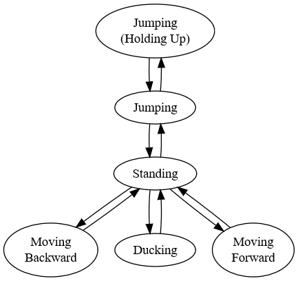
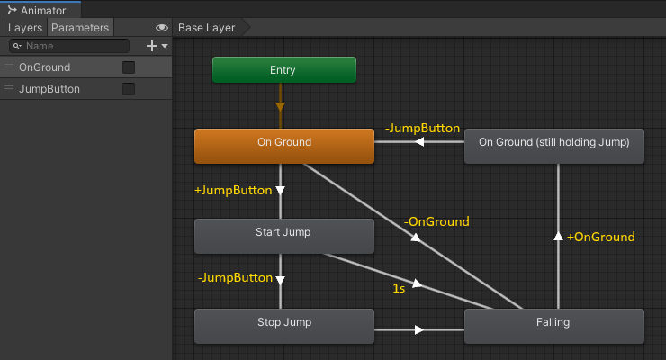

# State Machines
Avoid spaghetti code. Everything is a state machine. Decouple state from logic.

# Problem
An object should change its behavior when its internal state changes. That sounds very abstract, but it's a very common pattern in game code. Let's look at some examples.

1. Input handling: In a fighting game, pressing the *Punch* button should throw a different punch depending on whether the player is moving forward, backward, standing still, jumping, or ducking.
2. AI characters: Bots should react differently when spotting the player depending on their current health, weapons, and number of other bots nearby.
3. Game controller: Whether the ability to quit, pause, or save a game is available should depend on whether the game is loading, saving, paused, running, or quitting,

Once you get more familiar with the pattern, you will start seeing it everywhere.

The problem starts when you try to implement a state machine. It quickly looks like spaghetti code.

```csharp
if (Input.GetButton("Punch")) {
    if (player.velocity.z > 0) {
        ForwardPunch();
    } else if (player.velocity.z < 0) {
        Grapple();
    } else if (player.isJumping) {
        if (Input.GetAxis("Vertical") > 0) {
            UpwardPunch();
        } else {
            DownwardPunch();
        }
    } else if (player.isDucking) {
        UpwardPunch();
    } else {
        StandingPunch();
    }
}
```
Not only is the above code hard to understand, it's also incomplete and contains at least one bug.

# Solution
Every branch in your code represents a different state. Draw them on a piece of paper and connect them with arrows representing the state changes.



 The hard part is making sure all the state changes are in the right place and getting triggered correctly, but that's independent from implementing what the *Punch* button is doing in each state.

Okay, so now that we know the *shape* of the problem, how do we implement it?

## Animators
The graph above looks a lot like an [animator controller](https://docs.unity3d.com/Manual/Animator.html) in Unity. And that's exactly what we are going to use, because it turns out an animator controller can do so much more than just playing a bunch of animations. Let's walk through an example to see how it works.

# Example
Suppose we are implementing input handling for a Jump 'n' Run game instead of a fighting game. We want to support genre staples like
1. variable jump height depending on how long the player holds the *Jump* button,
2. [coyote time](https://celestegame.fandom.com/wiki/Moves#Coyote_Time), and
3. double jump.

## Jump controller

We start by creating a new animator controller. Our boolean input parameters are whether the *Jump* button is pressed and whether the player is currently on the ground.

Our first state is `On Ground`. That is when the player is able to jump at all. We also need the opposite state, which is `Falling`, and then a few more states which become clearer when we look at the conditions for the state transitions.



Let's look at the `On Ground` state. When the player presses the *Jump* button we start a jump. When the player releases the *Jump* button, we stop the jump by running some game logic to make sure the player character doesn't rise much higher anymore. We then immediately transition to the `Falling` state and we keep falling until the player character touches ground again.

If we transitioned back to `On Ground` straight from `Falling` as soon as the player touches ground, we would end up in a situation where the player would keep bouncing up and down like on a trampoline simply by keeping the *Jump* button pressed, because our state machine would immediately transition back to `Start Jump`. To fix that, we have to add an intermediary state `On Ground (still holding Jump)`.

Wow, jumping is hard. There is a lot of logic in our state machine already and we have only covered the basics so far. We can see how this would have been a lot of spaghetti code already.

## TODO Code

## Coyote time


Fortunately, laying the groundworks was the hard part already. Adding [coyote time](https://celestegame.fandom.com/wiki/Moves#Coyote_Time) is simply a matter of adding one more state with a very short timeout of 50 milliseconds. Even though the player character is not technically on ground anymore, we still allow them to perform a jump for a few frames. [Game feel](https://youtu.be/OfSpBoA6TWw?t=833)!

Perhaps most surprisingly, we don't need to touch any code at all. Everything happens still happens in `Start Jump` and `Stop Jump` just like before. It just works.

## Double jump


Double jumping means we give the player a second jump when falling. How does the second jump work? Just like the first jump. So let's copy the relevant states, put them to the right of `Falling`, and connect them up. The *shape* of the problem stays the same.

All we have to do to make it work is making sure that the *Jump* button is not being held before we do the second jump, because otherwise we would have the same trampoline problem we had in the very beginning. And just like before, we solve it by adding an intermediary state `Falling (still holding Jump)`.

In terms of code, again, we don't have to do anything at all. It just works.

Now we can really see the benefit of decoupling the state handling logic from the jump physics implementation. The state machine was the hard part. And that's good, because we use an animator controller to represent our state machine and animator controllers are super easy to debug. Press play and Unity shows you exactly which state is currently active. Compare that to what you see in game and you will spot the bug immediately.

## Footnotes

We should split the transition outgoing from `Falling`. One should go directly to `On Ground` under the condition `+OnGround, -JumpButton` and the other one should go to `On Ground (still holding Jump)` under the condition `+OnGround, +JumpButton`. However, in this particular case we can get by with just one transition, because we know we won't actually *do* anything in the intermediary state, and the animator will immediately transition out of it, if the *Jump* button isn't actually being held.

There's also a bug where we don't transition back to `Falling` when walking over the edge of the current platform while begin in `On Ground (still holding Jump)`. It was difficult to spot at the beginning because it only matters once we have double jump.

## References

- [Don’t Re-invent Finite State Machines: How to Repurpose Unity’s Animator](https://medium.com/the-unity-developers-handbook/dont-re-invent-finite-state-machines-how-to-repurpose-unity-s-animator-7c6c421e5785) by Darren Tsung
- [Unite 2015 - Applied Mecanim : Character Animation and Combat State Machines](https://www.youtube.com/watch?v=Is9C4i4XyXk) by Aaron Horne
- [Advanced AI in Unity (made easy) - State Machine Behaviors](https://www.youtube.com/watch?v=dYi-i83sq5g) by Noa Calice
- [Game Programming Patterns - State](http://gameprogrammingpatterns.com/state.html) by Bob Nystrom

# Translations
- [台灣繁體中文 (zh-TW)](README-zh-TW.md)

If you find this workshop useful and speak another language, I'd very much appreciate any help translating the chapters. Clone the repository, add a localized copy of the README.md, for example README-pt-BR.md, and send me a pull request.
