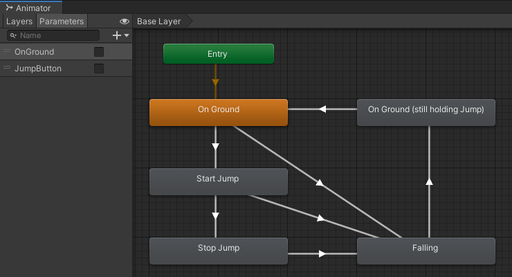
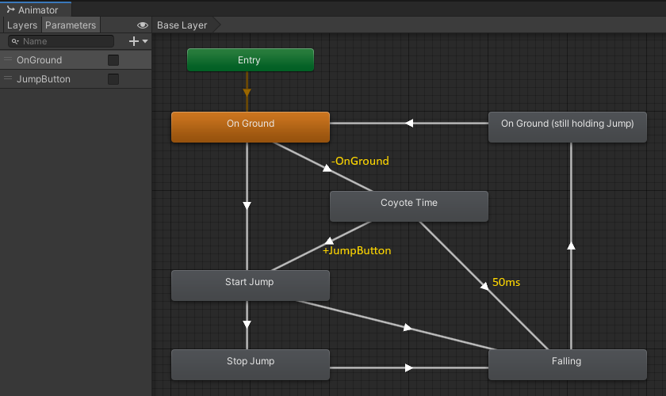
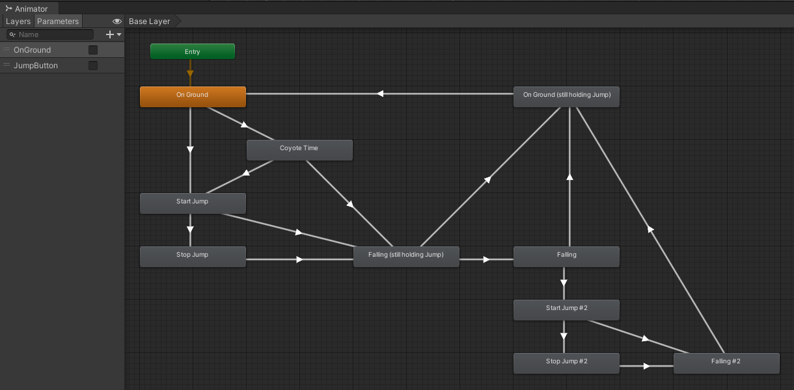

# State Machines
Visual scripting.

# Problem
An object should change its behavior when its internal state changes.
Spaghetti code.

# Solution
- Animator instead of code
- Visualization

# Example
Finite state machines are useful when you have an entity whose behavior changes based on some internal state, that state can be rigidly divided into one of a relatively small number of distinct options, and the entity responds to a series of inputs or events over time.

In games, they are most known for being used in AI, but they are also common in implementations of user input handling, navigating menu screens, parsing text, network protocols, and other asynchronous behavior.

## Jump controller

## Coyote time

## Double jump

## References

- [Don’t Re-invent Finite State Machines: How to Repurpose Unity’s Animator](https://medium.com/the-unity-developers-handbook/dont-re-invent-finite-state-machines-how-to-repurpose-unity-s-animator-7c6c421e5785) by Darren Tsung
- [Unite 2015 - Applied Mecanim : Character Animation and Combat State Machines](https://www.youtube.com/watch?v=Is9C4i4XyXk) by Aaron Horne
- [Advanced AI in Unity (made easy) - State Machine Behaviors](https://www.youtube.com/watch?v=dYi-i83sq5g) by Noa Calice
- [Game Programming Patterns - State](http://gameprogrammingpatterns.com/state.html) by Bob Nystrom
